# Java database test - with rest

## How to replicate:
- first you will need a postgreSQL server running on port 5432 (the default)
- we will need a database called `dbTest_1`
- use the given database backup in the `database_folders` folder to hopefully recreate the db.
- dbeaver dumps in a tar archive. I hope it works in windows

- then you may use postman to interract with the system. it should open a port on 8080 where you can send requests to `/users` to do things

## Usage

- a `GET` request will list all users. use `/users/{id}` to get a specific user.

- to update a user simply send a `PUT` request to the specific user page (`/users/{id}`). You will need to send json in the format:

```
{
    "email_address": "sample@example.com",
    "password_hash": "adfgrtwqa",
    "password_salt": "abddasdas",
    "user_name": "changed name"
}
```
as i did not implement partial updates at the moment.

- to delete a user send a `DELETE` request to the user page

## Other stuff

there are also other methods that are available. the hyperlinks on the endpoints should be descriptive enough to not need any documentation

endpoints:

- /users
- /addresses
- /contact_informations
- /books
- /borrowings

you will need to add things like books to borrowings or an adress to a user manually with `PUT`

## Screenshots
These screenshots were taken as the api was getting implemented. Earlier screenshots may not expose all endpoints like `/books/id/current_borrowing`
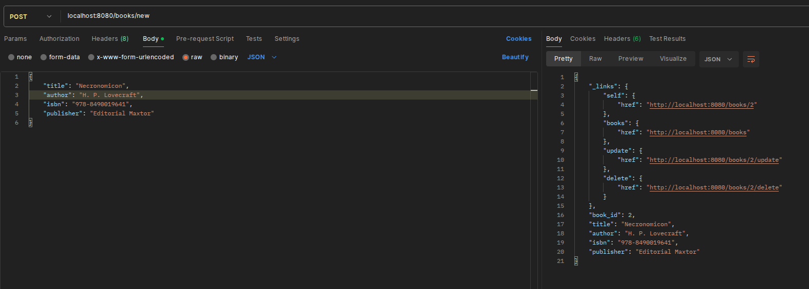
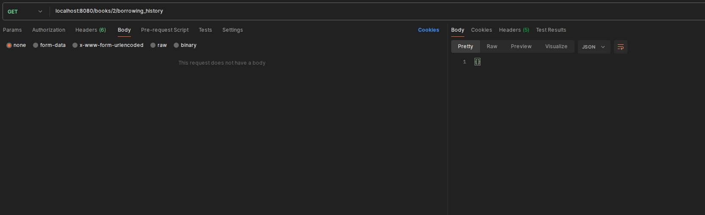
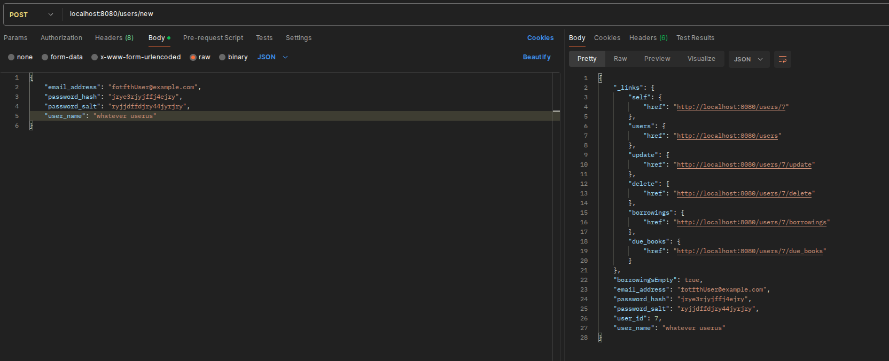
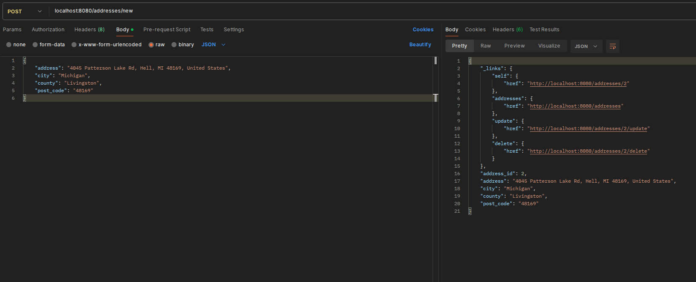
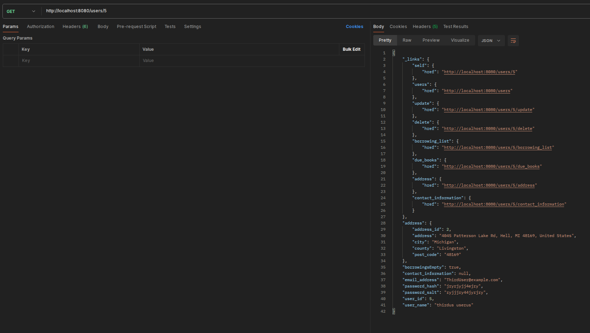
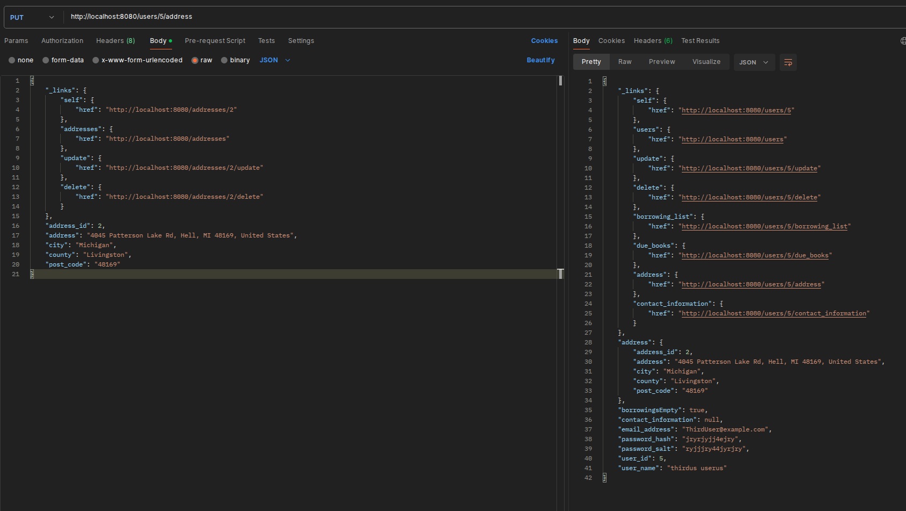
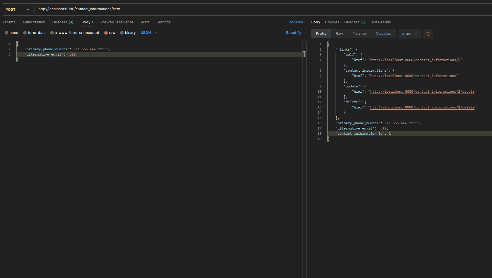
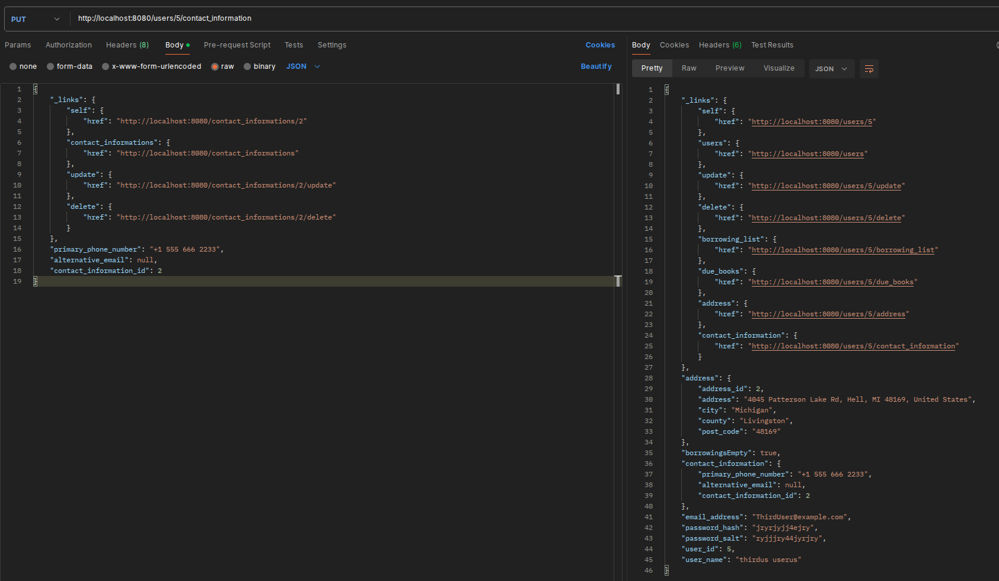
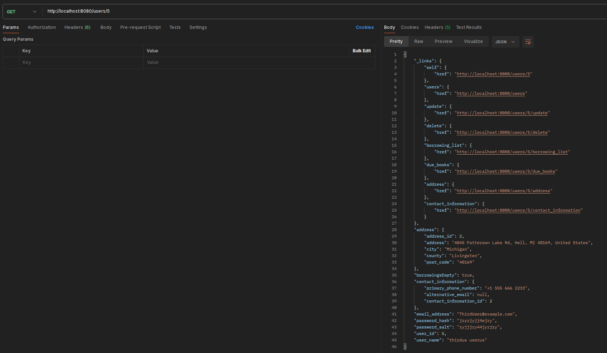
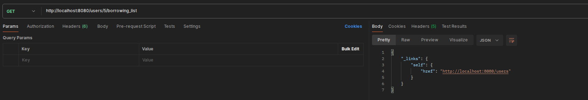
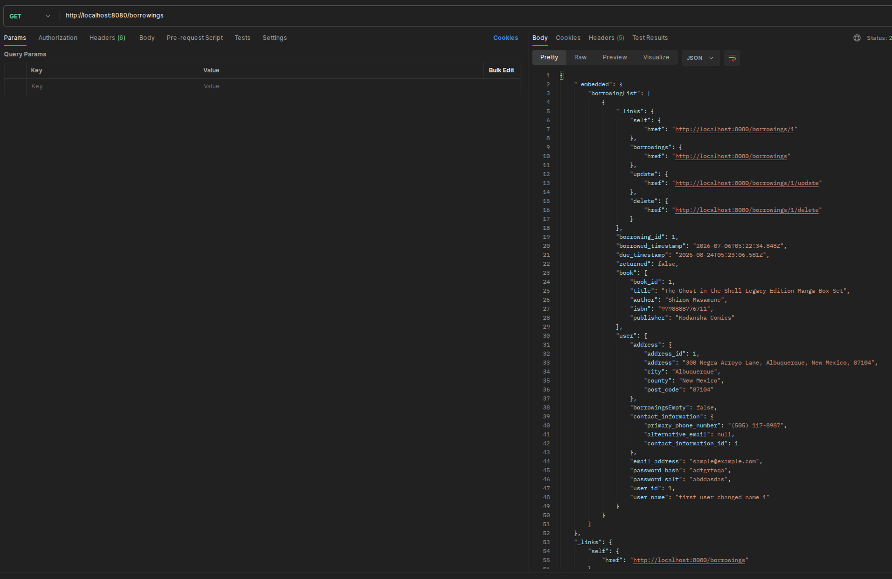
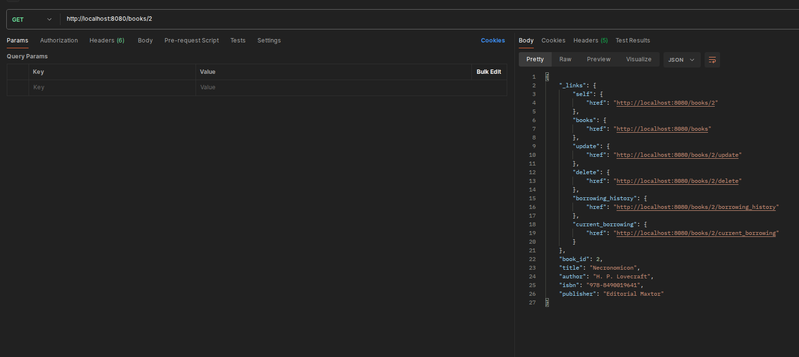
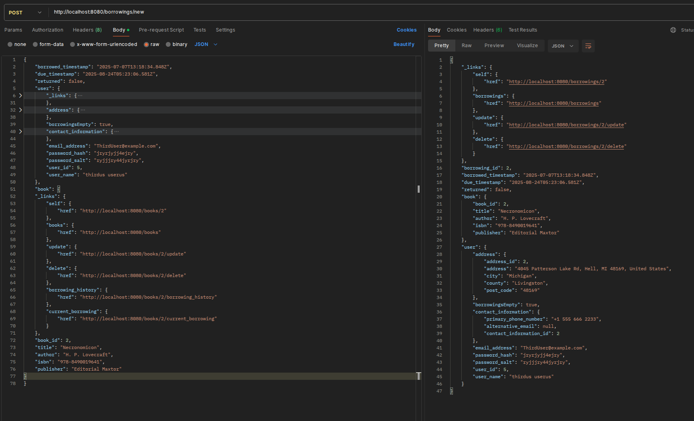
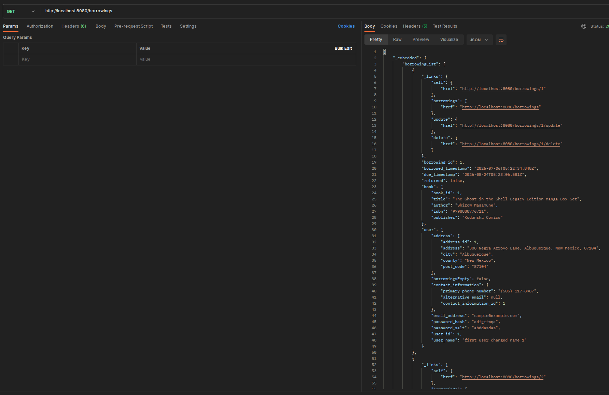
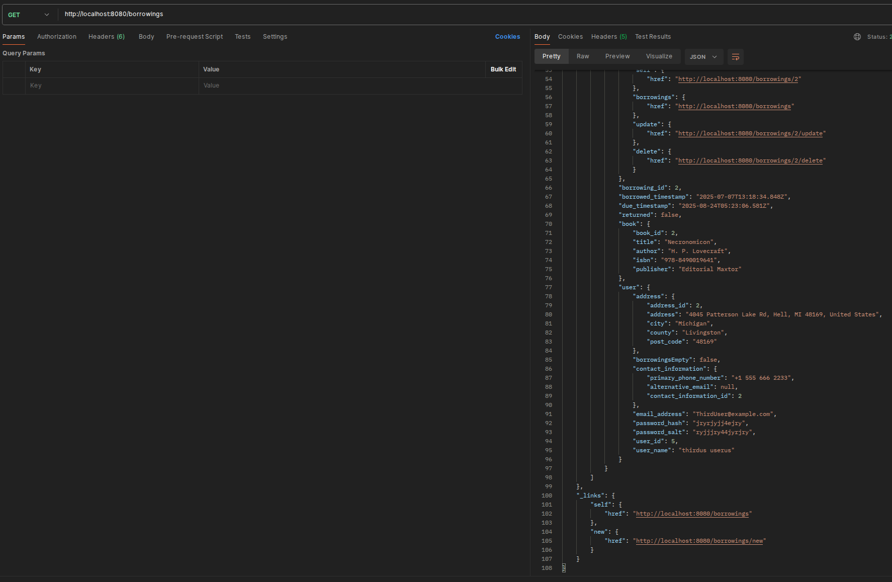
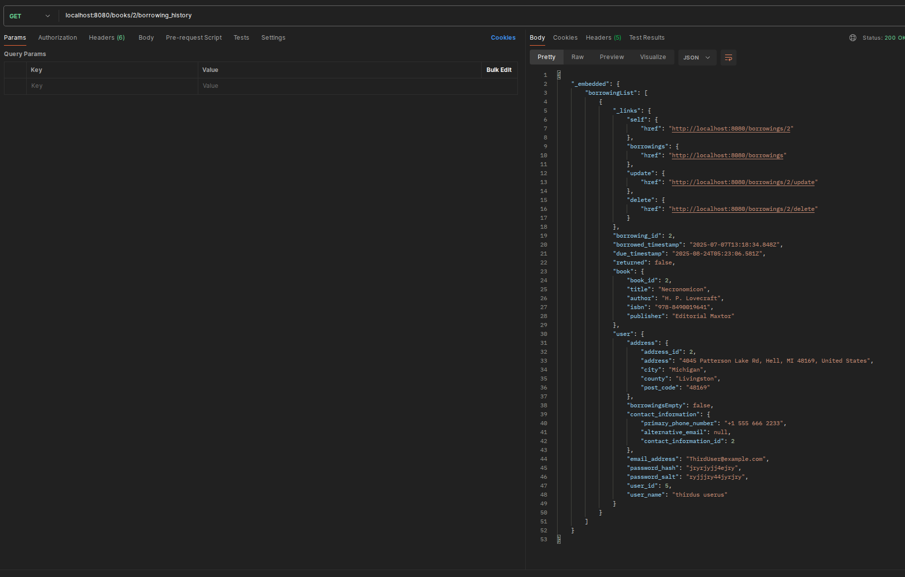
